# Architecture Overview: Intelligent Local Music Player

## 1. System Philosophy & Objectives

The application is a **free, open-source, local-first desktop music player** engineered with a heavy backend emphasis. The core mission is to provide an offline-capable, highly responsive, privacy-respecting audio player that delivers smart music recommendations and deep listening statistics without relying on paid infrastructure, remote servers, or proprietary cloud dependencies.

### Core Architectural Principles
* **Local-First & Offline-Centric**: Core functionality—audio playback, library indexing, metadata extraction, search, history logging, statistics, and local recommendations—operates 100% offline without remote network access.
* **Backend-Heavy Modular Monolith**: All application state, domain logic, data processing, recommendation algorithms, ranking models, and audio decoding reside within the Rust backend.
* **Thin Presentation Layer**: The frontend (React + TypeScript running inside Tauri) acts purely as a presentation and user input shell. It issues strongly typed commands/queries and subscribes to backend event streams. It executes zero audio decoding, ranking, or database queries.
* **Command & Event Separation**: User actions are submitted as discrete **Commands** to a **Central Processor**. State transitions and system occurrences are published across an **Event Bus** as strongly typed **Events**.
* **Provider Abstraction**: External metadata and discovery integrations (Spotify, MusicBrainz, Cover Art Archive, Soulseek) are isolated behind strict provider traits, ensuring zero runtime coupling to third-party availability.

---

## 2. High-Level Architecture Diagram

```mermaid
flowchart TD

subgraph group_frontend["Desktop UI"]
  node_react_ui["React UI<br/>[App.tsx]"]
  node_api_bridge["API Bridge<br/>[api.ts]"]
end

subgraph group_application["Application Core"]
  node_tauri_gateway["Tauri Gateway<br/>[app.rs]"]
  node_core_processor["Core Processor<br/>[processor.rs]"]
  node_event_bus["Event Bus<br/>[event_bus.rs]"]
end

subgraph group_media["Library Playback"]
  node_library_service["Library Service<br/>[service.rs]"]
  node_library_scanner["Library Scanner<br/>[scanner.rs]"]
  node_folder_watcher["Folder Watcher<br/>[watcher.rs]"]
  node_playback_service["Playback Service<br/>[service.rs]"]
  node_history_service["History Service<br/>[service.rs]"]
end

subgraph group_intelligence["Discovery Intelligence"]
  node_discovery["Discovery Coordinator<br/>[coordinator.rs]"]
  node_recommendations["Recommendation Engine<br/>[recommendations/]"]
  node_ranking_engine["Ranking Engine<br/>[engine.rs]"]
  node_wishlist_manager["Wishlist Manager<br/>[wishlist.rs]"]
end

subgraph group_integrations["Data Integrations"]
  node_sqlite[("SQLite Database<br/>[mod.rs]")]
  node_playlist_repo["Playlist Repository<br/>[playlist_repo.rs]"]
  node_provider_coordinator["Provider Coordinator<br/>[coordinator.rs]"]
  node_download_service["Download Service<br/>[service.rs]"]
  node_cloud_sync["Cloud Sync<br/>[sync_manager.rs]"]
  node_cloud_client["Cloud Client<br/>[client.rs]"]
end

node_user(("User"))
node_metadata_providers["Metadata Providers"]
node_download_sources["Download Sources"]
node_spotify_api["Spotify API"]
node_cloud_api["Cloud API"]

node_user -->|"uses"| node_react_ui
node_react_ui -->|"calls"| node_api_bridge
node_api_bridge -->|"invokes"| node_tauri_gateway
node_tauri_gateway -->|"dispatches"| node_core_processor
node_core_processor -->|"publishes"| node_event_bus
node_event_bus -->|"emits events"| node_tauri_gateway
node_tauri_gateway -->|"updates"| node_react_ui
node_core_processor -->|"queries"| node_library_service
node_core_processor -->|"commands"| node_playback_service
node_core_processor -->|"queries"| node_discovery
node_core_processor -->|"queries"| node_ranking_engine
node_core_processor -->|"commands"| node_download_service
node_core_processor -->|"coordinates sync"| node_cloud_sync
node_library_service -->|"scans"| node_library_scanner
node_folder_watcher -->|"notifies changes"| node_library_service
node_library_scanner -->|"writes catalog"| node_sqlite
node_library_service -->|"reads catalog"| node_sqlite
node_playback_service -->|"reads tracks"| node_sqlite
node_playback_service -->|"publishes playback"| node_event_bus
node_event_bus -->|"delivers playback"| node_history_service
node_history_service -->|"records history"| node_sqlite
node_ranking_engine -->|"reads statistics"| node_sqlite
node_recommendations -->|"reads listening data"| node_sqlite
node_discovery -->|"builds mixes"| node_recommendations
node_discovery -.->|"requests metadata"| node_provider_coordinator
node_provider_coordinator -.->|"looks up metadata"| node_metadata_providers
node_playlist_repo -->|"reads writes"| node_sqlite
node_core_processor -->|"manages playlists"| node_playlist_repo
node_download_service -->|"uses wishlist"| node_wishlist_manager
node_download_service -.->|"searches sources"| node_download_sources
node_download_service -->|"stores tasks"| node_sqlite
node_core_processor -.->|"imports Spotify"| node_provider_coordinator
node_provider_coordinator -.->|"imports playlist"| node_spotify_api
node_cloud_sync -->|"reads writes"| node_sqlite
node_cloud_sync -.->|"uses"| node_cloud_client
node_cloud_client -.->|"HTTPS"| node_cloud_api

click node_react_ui "https://github.com/selfannihilator/kaze/blob/prod/src/App.tsx"
click node_api_bridge "https://github.com/selfannihilator/kaze/blob/prod/src/services/api.ts"
click node_tauri_gateway "https://github.com/selfannihilator/kaze/blob/prod/src-tauri/src/app.rs"
click node_core_processor "https://github.com/selfannihilator/kaze/blob/prod/src-tauri/src/core/processor.rs"
click node_event_bus "https://github.com/selfannihilator/kaze/blob/prod/src-tauri/src/core/event_bus.rs"
click node_library_service "https://github.com/selfannihilator/kaze/blob/prod/src-tauri/src/library/service.rs"
click node_library_scanner "https://github.com/selfannihilator/kaze/blob/prod/src-tauri/src/library/scanner.rs"
click node_folder_watcher "https://github.com/selfannihilator/kaze/blob/prod/src-tauri/src/library/watcher.rs"
click node_playback_service "https://github.com/selfannihilator/kaze/blob/prod/src-tauri/src/playback/service.rs"
click node_history_service "https://github.com/selfannihilator/kaze/blob/prod/src-tauri/src/history/service.rs"
click node_sqlite "https://github.com/selfannihilator/kaze/blob/prod/src-tauri/src/database/mod.rs"
click node_discovery "https://github.com/selfannihilator/kaze/blob/prod/src-tauri/src/discovery/coordinator.rs"
click node_recommendations "https://github.com/selfannihilator/kaze/blob/prod/src-tauri/src/recommendations/mod.rs"
click node_ranking_engine "https://github.com/selfannihilator/kaze/blob/prod/src-tauri/src/ranking/engine.rs"
click node_playlist_repo "https://github.com/selfannihilator/kaze/blob/prod/src-tauri/src/database/repositories/playlist_repo.rs"
click node_wishlist_manager "https://github.com/selfannihilator/kaze/blob/prod/src-tauri/src/discovery/wishlist.rs"
click node_provider_coordinator "https://github.com/selfannihilator/kaze/blob/prod/src-tauri/src/providers/coordinator.rs"
click node_download_service "https://github.com/selfannihilator/kaze/blob/prod/src-tauri/src/downloads/service.rs"
click node_cloud_sync "https://github.com/selfannihilator/kaze/blob/prod/src-tauri/src/cloud/sync_manager.rs"
click node_cloud_client "https://github.com/selfannihilator/kaze/blob/prod/src-tauri/src/cloud/client.rs"

classDef toneNeutral fill:#f8fafc,stroke:#334155,stroke-width:1.5px,color:#0f172a
classDef toneBlue fill:#dbeafe,stroke:#2563eb,stroke-width:1.5px,color:#172554
classDef toneAmber fill:#fef3c7,stroke:#d97706,stroke-width:1.5px,color:#78350f
classDef toneMint fill:#dcfce7,stroke:#16a34a,stroke-width:1.5px,color:#14532d
classDef toneRose fill:#ffe4e6,stroke:#e11d48,stroke-width:1.5px,color:#881337
classDef toneIndigo fill:#e0e7ff,stroke:#4f46e5,stroke-width:1.5px,color:#312e81
classDef toneTeal fill:#ccfbf1,stroke:#0f766e,stroke-width:1.5px,color:#134e4a
class node_react_ui,node_api_bridge toneBlue
class node_tauri_gateway,node_core_processor,node_event_bus toneAmber
class node_library_service,node_library_scanner,node_folder_watcher,node_playback_service,node_history_service,node_spotify_api,node_cloud_api toneMint
class node_discovery,node_recommendations,node_ranking_engine,node_wishlist_manager toneRose
class node_sqlite,node_playlist_repo,node_provider_coordinator,node_download_service,node_cloud_sync,node_cloud_client,node_user,node_metadata_providers,node_download_sources toneIndigo
```

---

## 3. Core Component Responsibilities

### 3.1 Central Processor (`CoreProcessor`)
The `CoreProcessor` is the central orchestrator of the entire system.
* Receives command requests originating from Tauri IPC or internal triggers.
* Validates inputs, schema requirements, and preconditions.
* Dispatches commands to the appropriate service domain.
* Tracks global orchestration state (e.g., scan in progress, playback state snapshot).
* Emits state changes onto the system event bus.

### 3.2 Playback Service
* Directly manages audio output devices using `rodio` and `cpal`.
* Maintains play/pause/seek states, volume attenuation, playback queue, repeat, and shuffle logic.
* Computes precise continuous playback timestamps.
* Emits fine-grained events: `TrackStarted`, `TrackPaused`, `TrackFinished`, `PlaybackPositionChanged`, etc.
* Audio backend is encapsulated behind an `AudioBackend` trait to isolate device interaction.

### 3.3 Library Service & Scanner
* Registers, manages, and incrementally scans configured filesystem music directories.
* Uses `lofty` to extract comprehensive ID3v2, Vorbis, FLAC, and MP4 tags (artist, album, track number, disc, genre, year, duration, bitrate, sample rate, cover art, MusicBrainz tags).
* Implements file change detection via timestamp and size comparisons, backed by `notify` for filesystem events.
* Maintains SQLite library tables and FTS5 search index.

### 3.4 History & Statistics Service
* Logs granular listening history sessions (seconds listened, completion percentage, skip indicators).
* Evaluates rule-based "meaningful plays" (e.g., >= 30 seconds or >= 50% duration).
* Aggregates rolling statistics over standard time windows (Today, 7D, 30D, 6M, 1Y, All-Time).
* Computes weighted multi-factor rankings for tracks, artists, albums, and genres.

### 3.5 Taste Profile & Recommendation Engine
* Derives short-term and long-term user affinity scores across artists, genres, and eras.
* Produces offline Local Recommendations from the library using collaborative/content-based scoring.
* Generates temporary smart mixes (Daily Mix, On Repeat, Forgotten Favorites, Genre Mixes).
* Interfaces with discovery providers (MusicBrainz, Spotify) for recommendations outside the library.
* Emits transparent, human-readable explanations for every generated recommendation.

### 3.6 External Providers (Metadata & Downloads)
* Implements the `MetadataProvider` trait for MusicBrainz, Cover Art Archive, and Spotify.
* Enforces caching and graceful fallback: external API downtime never degrades local playback.
* Implements `DownloadProvider` for optional local Soulseek integration via documented local client interfaces/IPC.

### 3.7 Cloud-Backed Authentication & Cloudflare D1 Synchronization
* **Authoritative Cloud Account System**: Cloudflare Worker (`worker/`) bound to Cloudflare D1 acts as the sole authoritative account system. Dual local password authorities are eliminated; local SQLite never stores or checks password hashes.
* **Server-Side Security & PBKDF2 600,000 Iterations**:
  - Hashing: Web Crypto API PBKDF2-HMAC-SHA256 with 600,000 iterations and a cryptographically secure 16-byte random salt per user (exceeding OWASP password hashing recommendations). Web Crypto executes natively in C++ inside Cloudflare Workers V8 isolates with zero WASM/cold-start overhead and predictable resource bounds.
  - Timing Discrepancy Defense: Login requests for non-existent users perform a dummy PBKDF2 verification (`DUMMY_HASH`) to prevent timing side-channel attacks and user enumeration. Generic `"Invalid username or password"` responses are strictly enforced.
  - Rate Limiting: D1-backed sliding-window rate limiting on `/api/auth/login` (5 req/min per IP) and `/api/auth/register` (3 req/min per IP) returning HTTP 429 Too Many Requests with `Retry-After`.
  - Input Validation: Server-side validation enforcing 3–50 character alphanumeric/punctuation usernames and 8–128 character passwords.
* **Hardened Hybrid Session Architecture**:
  - **Opaque Cryptographic Tokens**: 256-bit cryptographically secure random bearer tokens generated via `crypto.getRandomValues`. The raw token is returned to the client once upon registration/login and is never stored in D1 or SQLite.
  - **D1 Storage**: Stores only SHA-256 hash (`token_hash`) along with session metadata: `id`, `user_id`, `device_id`, `device_name`, `client_version`, `created_at`, `last_used_at`, `idle_expires_at`, `absolute_expires_at`, `revoked_at`, `revoked_reason`.
  - **Hybrid Expiry & Validation**:
    - **Idle Window**: 30-day inactivity timeout (`now < idle_expires_at`).
    - **Hard Ceiling**: 90-day absolute expiration from session creation (`now < absolute_expires_at`).
    - **Revocation**: Strictly requires `revoked_at IS NULL`.
    - **D1 Write Throttling**: Updates `last_used_at` and `idle_expires_at` in D1 at most once every 30 minutes (`now - last_used_at >= 1800`), sliding the idle timeout forward by `min(now + 30 days, absolute_expires_at)` without write amplification.
  - **Client-Side Storage**:
    - Secure OS Keyring: Raw bearer token persisted in native OS credential storage (`keyring` crate) with restricted `0600` file fallback.
    - Local SQLite (`cloud_sessions`): Stores non-secret metadata only (`session_id`, `device_id`, `device_name`, `idle_expires_at`, `absolute_expires_at`, `last_cloud_validation_at`, `worker_url`).
  - **Device Identity**: Persistent random UUID v4 generated on first launch (`application_settings` key `"device_id"`) and non-invasive friendly device name derived from the operating system.
  - **Multi-Device Session Control**:
    - `POST /api/auth/logout`: Revokes the current session.
    - `POST /api/auth/logout-all`: Revokes all active sessions for the user.
    - `GET /api/auth/sessions`: Lists active sessions with `is_current: true` flag.
    - `DELETE /api/auth/sessions/:id`: Revokes specific session with user ownership validation.
    - Scheduled background cleanup bounded to prune revoked/expired sessions older than 30 days.
* **Client Session Lifecycle & Offline Continuation**:
  - Strongly typed state machine: `SignedOut`, `Authenticating`, `OnlineAuthenticated`, `OfflineAuthenticated`, `SessionExpired { reason }`, `CloudUnavailable`, `SyncPaused`.
  - An authenticated client device with `authenticated_before = 1` retains offline continuation as `OfflineAuthenticated` when within local `idle_expires_at` and `absolute_expires_at` windows without extending cloud validity offline.
* **Access Gating & Non-Destructive Logout**:
  - Authentication strictly governs **access**, not data existence.
  - Logging out (`Logout`, `LogoutAll`) purges bearer tokens from keyring/fallback storage and resets memory session states (`current_user = None`).
  - User-owned SQLite data (custom playlists, playlist tracks, track likes/dislikes, play history, listening statistics) is **never deleted** on logout.
  - UI queries are strictly access-gated: signed-out users receive only algorithmic Smart Mixes; authenticated users receive their personal playlists and cloud-synchronized content.
* **Deterministic Cloud Synchronization Flow (Pull -> Reconcile -> Push)**:
  - **Sequence**: On login or startup, the client establishes `ActiveUser`, **Pulls** remote changes first, **Reconciles** them into local SQLite, **Pushes** local modifications and pending tombstones, and emits `Event::PlaylistsUpdated` to trigger reactive frontend refreshes.
  - **Liked and Disliked Songs**: Synchronizes `manual_like` ratings (`1` = liked, `-1` = disliked, `0` = neutral) across devices. Rated songs (even if not in any playlist) are collected in sync payloads. Worker upserts use `manual_like = excluded.manual_like`, enabling transitions between liked, disliked, and neutral states.
  - **Sync Tombstones**: Explicit deletions (`DeletePlaylist`, `RemoveTrackFromPlaylist`) record entries in the `sync_tombstones` SQLite table. Local absence without a tombstone never deletes remote data during pull reconciliation. Remote deletions are executed when tombstones are pushed, and tombstones are safely cleared upon confirmed sync acknowledgment.
  - **Selective Synchronization Scope**: Synchronizes essential user entities only: `songs`, `playlists`, `playlist_songs`, `song_stats`, `user_stats`, and `user_settings`.

### 3.8 User Profile & Cloudinary Avatar Storage
* **Decoupled Metadata & Cloud Binary Storage**:
  - D1 user metadata: Stores only non-binary profile metadata (`display_name`, `avatar_public_id`, `avatar_url`, `avatar_version`, `avatar_key`, `avatar_updated_at`). Zero image binaries or base64 strings are stored in D1 to prevent database bloating and respect edge D1 quotas.
  - Storage Abstraction (`AvatarStorage`): The Cloudflare Worker defines a pluggable `AvatarStorage` interface with `CloudinaryAvatarStorage` (default, credit-card free) and `R2AvatarStorage` (optional fallback).
  - Cloudinary Storage: Stores normalized WebP avatars under public ID prefix `music-player/avatars/{user_id}` with `overwrite = true` and `invalidate = true`. Uploads and deletions are cryptographically signed using SHA-1 on the Worker.
  - Credentials Security Boundary: `CLOUDINARY_CLOUD_NAME`, `CLOUDINARY_API_KEY`, and `CLOUDINARY_API_SECRET` are stored strictly as Cloudflare Worker secrets. The desktop client and frontend never see or store the API secret.
* **Client-Side Image Normalization**:
  - Input images (JPEG, PNG, WebP) are processed client-side before upload using the Rust `image` crate.
  - Transformation: Decodes image bytes, performs a centered square crop (`crop_imm`), resizes to 256×256 pixels using Lanczos3 filtering (`FilterType::Lanczos3`), and encodes to WebP format.
  - Target output: 256×256 WebP (~20–100 KB). Payload limit enforced at 5 MB.
* **Local Disk Cache & Offline Resilience**:
  - Normalized avatars are saved locally to `<cache_dir>/avatars/{user_id}.webp`.
  - On application startup or offline mode, the cached avatar is immediately served via base64 data URL with zero network latency.
  - Startup checks compare `avatar_updated_at` / `avatar_version` against local cache to prevent redundant re-downloads when images are unchanged.
  - Modifying or deleting avatars requires an active internet connection and valid authenticated session; unauthorized or offline changes are rejected gracefully.
  - Fallback avatar: First letter of username rendered over a dynamic gradient circle when no avatar is configured.
* **Profile Navigation & Search Bar Visibility**:
  - Stats section renamed to "Profile" across navigation sidebar and view hierarchy.
  - Profile photo edit is accessible directly via a pencil icon positioned on the profile circle.
  - Global top search bar is hidden when viewing the Profile section to prioritize user identity and account settings.

---

## 4. Threading & Concurrency Model

1. **Main UI Thread**: Runs the Tauri webview and desktop window event loop.
2. **Tokio Async Runtime**: Manages asynchronous I/O (database queries via `sqlx`, filesystem notifications via `notify`, external HTTP calls via `reqwest`, background workers).
3. **Dedicated Audio Thread**: `rodio` and `cpal` operate in a high-priority native audio thread to guarantee glitch-free, low-latency audio rendering independent of CPU-bound file scanning or database operations.
4. **Internal Event Bus**: Backed by `tokio::sync::broadcast` channels, decoupling command handling from asynchronous event listeners.

---

## 5. Frontend Performance Architecture & State Isolation

* **Isolated High-Frequency Pub-Sub (`playbackProgress`)**:
  - High-frequency playback position updates (4–10 Hz) are strictly decoupled from root `App` component state.
  - Position ticks are routed through a localized pub-sub emitter (`src/services/playbackProgress.ts`), ensuring only active progress bars (`NowPlayingProgressBar`) and lyrics subscribers re-render.
  - Root `App`, sidebar, top bar, and library views undergo 0 re-renders per second during standard audio playback.
* **Virtualized Windowed Song Lists**:
  - Large collection and library tables utilize windowed row virtualization via `react-window` 2.x, bounding mounted DOM nodes to visible rows + overscan regardless of whether the library contains 50 or 50,000 tracks.
* **Asynchronous Code Splitting**:
  - Non-initial views (`DiscoveryView`, `StatsView`, `SettingsView`, `FullScreenPlayerView`, `LyricsView`, and modals) are lazy-loaded on demand via `React.lazy` and `Suspense`, dropping initial JavaScript bundle size from 528 kB to 383 kB.
* **WebKitGTK Compositor Efficiency**:
  - Expensive `backdrop-filter: blur(...)` invocations are strictly bounded to transparent modal backdrops, avoiding repeated per-card blur contexts in WebKitGTK.
* **Embedded SQLite Pool Sizing**:
  - Desktop SQLite connection pool bounded to `max_connections(4)` in WAL mode, conserving page cache memory without read/write starvation.
