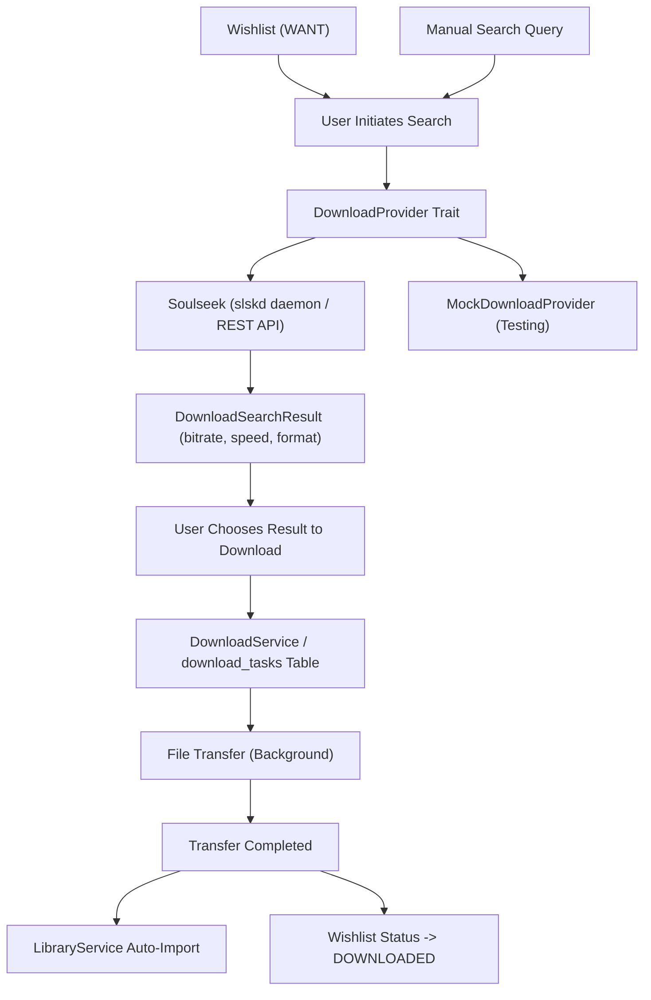

# Download Architecture & Soulseek Integration

## 1. Overview
The download subsystem fulfills the local-first promise of the intelligent music player: allowing users to acquire missing music directly from decentralized networks (Soulseek / Slskd) and automatically index it into their local library without paid subscriptions or third-party servers.

---

## 2. Core Principles
* **User-Initiated Only**: The application **never** downloads files automatically in the background without explicit user action. Searches and transfers are initiated by the user.
* **Protocol Abstraction (`DownloadProvider`)**: Audio acquisition is decoupled from Soulseek specifically. The trait supports Slskd, future decentralized protocols, or mock testing environments.
* **Graceful Degradation**: If the local Soulseek daemon is offline or uninstalled, the player functions normally with search returning empty results and reporting availability cleanly.
* **Auto-Import & Relational Consistency**: Completed downloads are immediately written into the configured music folder, scanned incrementally with `lofty`, and linked wishlist items transition to `DOWNLOADED`.

---

## 3. Data Models (`download_tasks` Table)

| Column | Type | Description |
| :--- | :--- | :--- |
| `id` | `TEXT PRIMARY KEY` | Unique download task ID (`dl_<uuid>`). |
| `provider` | `TEXT NOT NULL` | Provider name (`soulseek`, `mock_soulseek`). |
| `provider_task_id` | `TEXT` | Provider's internal transfer ID. |
| `title` | `TEXT NOT NULL` | Extracted or entered track title. |
| `artist` | `TEXT NOT NULL` | Extracted or entered track artist. |
| `album` | `TEXT` | Optional album title. |
| `filename` | `TEXT NOT NULL` | Destination file name. |
| `destination_path` | `TEXT` | Absolute path where file is written. |
| `file_size` | `INTEGER` | Total bytes expected. |
| `bytes_downloaded` | `INTEGER` | Current bytes received. |
| `status` | `TEXT` | `QUEUED`, `DOWNLOADING`, `COMPLETED`, `FAILED`, `CANCELLED`. |
| `error_message` | `TEXT` | Failure explanation if errored. |
| `wishlist_id` | `TEXT REFERENCES wishlist(id)` | Foreign key link to wishlist. |
| `created_at` | `INTEGER NOT NULL` | Creation timestamp. |
| `completed_at` | `INTEGER` | Completion timestamp. |

---

## 4. Slskd Daemon Integration
The primary Soulseek implementation communicates with `slskd`, a lightweight, headless Soulseek daemon running locally (via binary or Docker):
* **Default Endpoint**: `http://localhost:5030/api/v0`
* **Authentication**: Header `X-API-Key: {token}` (optional when running without auth).
* **Search API**: `POST /api/v0/search` with poll `GET /api/v0/search/{id}`.
* **Download API**: `POST /api/v0/transfers/downloads/{username}`.
* **Transfer Status**: `GET /api/v0/transfers/downloads`.
